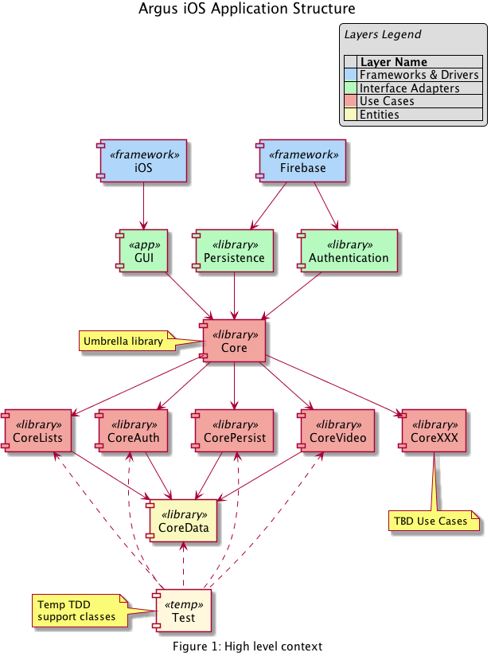

# ArgusCoreSiX
The umbrella framework that provides access to the core Argus modules (frameworks).

Figure 1 shows the context in which the Argus core components exist.

The following figure illustrates the context in which the Argus Core modules exist. The <<app>> module provides the UI code in as minimal a fashion as possible. It relies on the core to provide the main application features and functionality. Each <<library>> module is provided by a Swift (Cocoa Touch) Framework under the auspices of Carthage. In a very strong sense, the Main module "plugs in" to the Core. The Core can also be considered the Domain layer in the [Clean Architecture](https://8thlight.com/blog/uncle-bob/2012/08/13/the-clean-architecture.html) sense.

