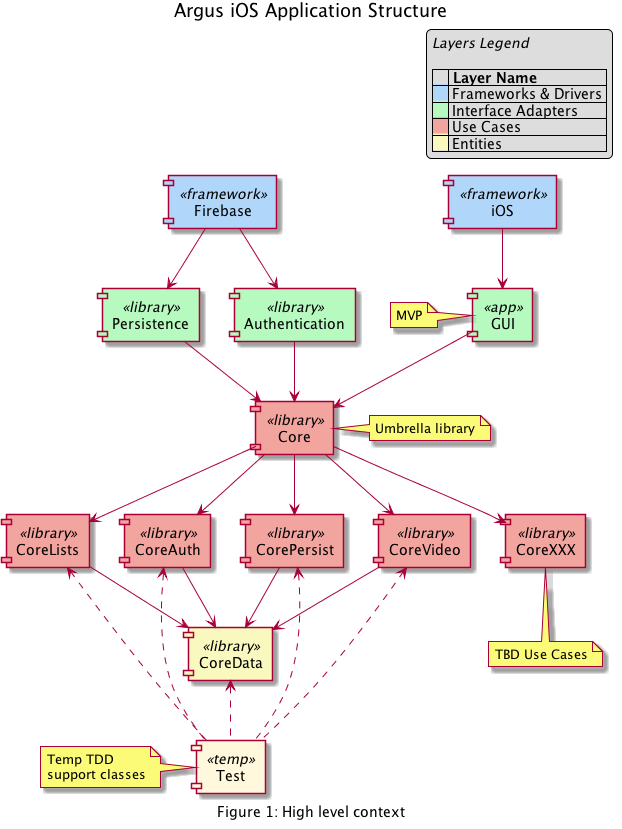

# ArgusCoreSiX
The umbrella framework that provides access to the core Argus modules (frameworks).

Figure 1 shows the high level context in which the Argus core components exist. These core components comprise the central layer of the module structure. Moving outward, the GUI, Persistence and Authentication modules adapt the facilities provided by the outer-most layer, the iOS and Firebase frameworks.

The `<<app>>` module provides the GUI code in as minimal a fashion as possible by invoking code in the core `<<library>>` modules to provide the main application features and functionality.

Each `<<library>>` module is provided by a Swift (Cocoa Touch) Framework (not to be confused with the iOS and Firebase framewoks) under the auspices of [Carthage](https://github.com/Carthage/Carthage#carthage--). In a very strong sense, the main (GUI) module "plugs in" to the Core. The Core can also be considered the Domain layer in the [Clean Architecture](https://8thlight.com/blog/uncle-bob/2012/08/13/the-clean-architecture.html) sense.

The _Core_ module acts as an umbrella to wrap the modules providing the core application functions. Each wrapped core module implements the Use Cases or provides the core data.

